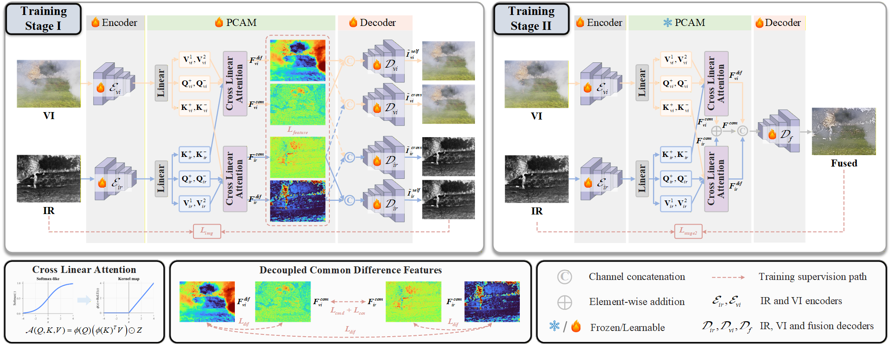
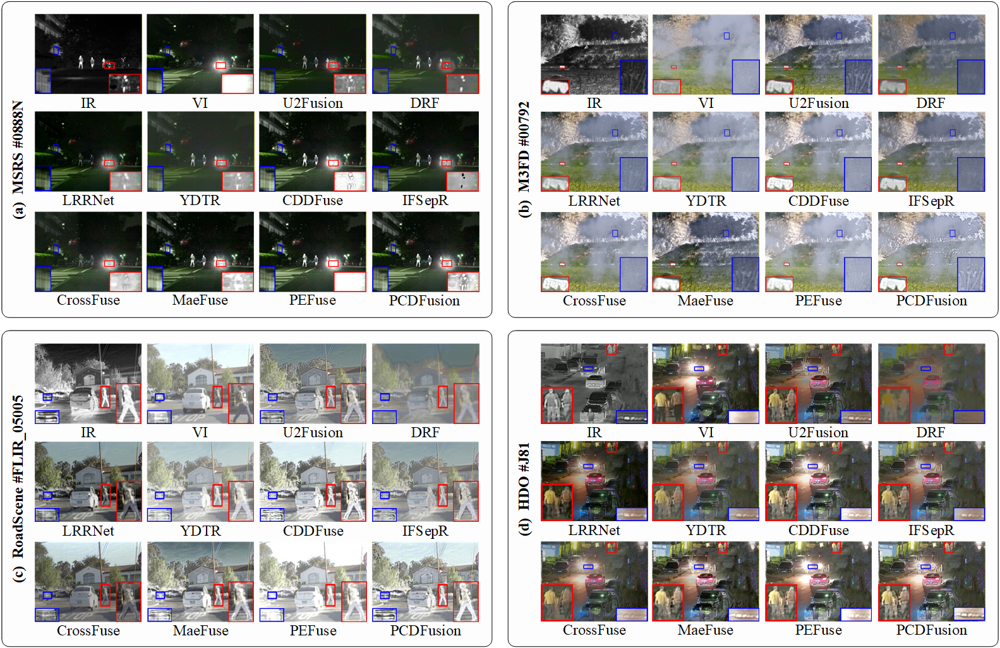
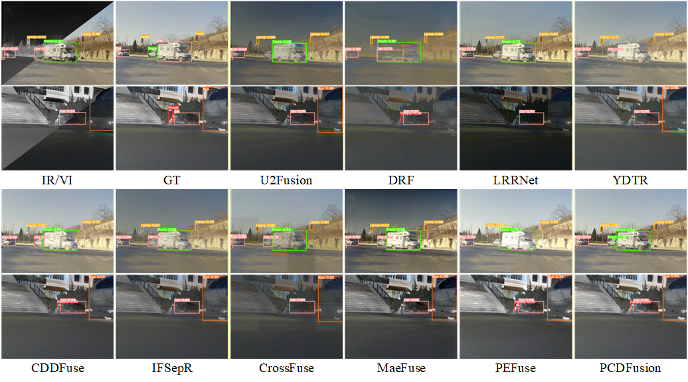
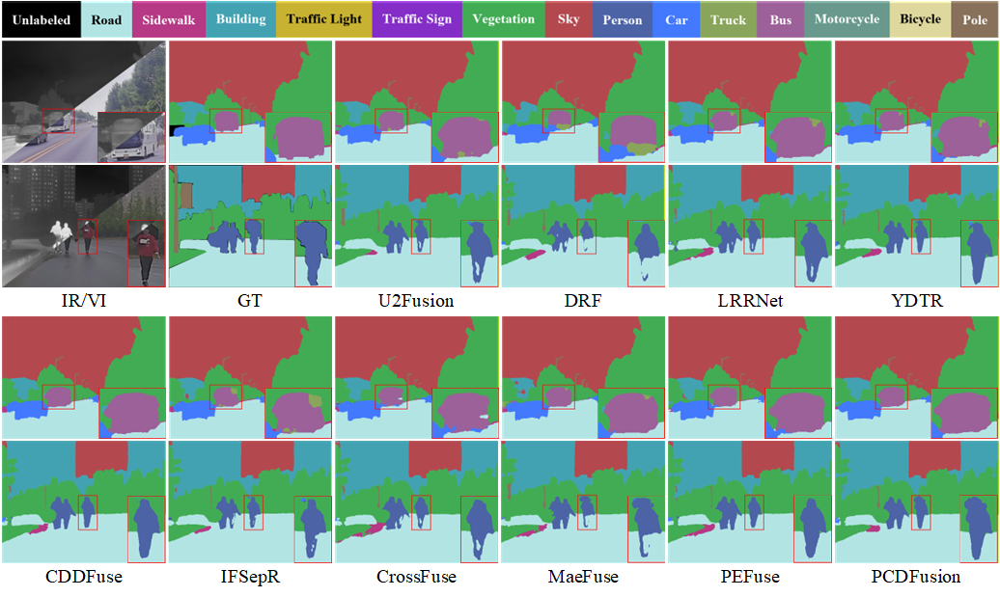

# PCDFusion

## This is the official project page of "PCDFusion: Polarity-Guided Common-Distinct Feature Decoupling for Infrared and Visible Image Fusion"

The official PyTorch implementation will be released here.

## 📌 Key Features

- 🔄 **Polarity Cross-Attention Module (PCAM)** for explicit common-distinct feature decoupling through cross-modal feature interactions.
- ➕➖ **Polarity-guided representation learning**, where same-polarity responses characterize cross-modal common information and cross-polarity responses capture modality-specific information.
- 🎯 **Explicit feature-level decoupling constraints** to enhance the consistency of common representations while suppressing redundant correlations between common and distinct features.
- 🔁 **Two-stage learning strategy**, consisting of reconstruction-guided feature decoupling and subsequent infrared-visible fusion learning.
- 🧩 Effective preservation of **shared scene structures, salient infrared targets, and visible texture details**.
- 📊 Extensive evaluations on **MSRS, M3FD, RoadScene, and HDO**, together with downstream object detection and semantic segmentation experiments.

## Framework

<p align="center">
  
</p>

PCDFusion adopts a two-stage framework for common-distinct feature decoupling and complementary infrared-visible image fusion.

In **Stage I**, the infrared and visible representations are decomposed into common and distinct components through the proposed PCAM. Self-reconstruction, cross-reconstruction, and feature-level constraints are jointly employed to establish stable common-distinct representations.

In **Stage II**, the learned decoupling capability of PCAM is preserved, while the common and distinct representations are complementarily integrated to generate the final fused image.

The core idea of PCAM is to decompose query and key representations according to their polarity. Same-polarity cross-modal interactions are used to characterize shared scene information, while cross-polarity interactions are exploited to represent modality-specific differences.

## Experiments

### Fusion Comparison

<p align="center">
  
</p>

Qualitative comparisons are conducted on the **MSRS, M3FD, RoadScene, and HDO** datasets.

Compared with representative infrared-visible image fusion methods, PCDFusion effectively preserves salient infrared targets while maintaining visible textures and scene structures under various imaging conditions, including low illumination, strong-light interference, and haze.

### Downstream Tasks Comparison

#### Object Detection

<p align="center">
  
</p>

We further evaluate the influence of different fusion methods on downstream object detection using **YOLOv10** on the **M3FD** dataset.

PCDFusion preserves target contours and salient infrared responses while retaining complementary visible appearance information, providing more discriminative fused representations for object detection.

#### Semantic Segmentation

<p align="center">
  
</p>

Semantic segmentation experiments are conducted using **SegFormer** on the **FMB** dataset.

The fused images generated by PCDFusion provide clearer semantic boundaries and more complete object structures, demonstrating the effectiveness of common-distinct feature modeling for downstream scene understanding.

## If This Work Is Helpful to You, Please Cite It As:

```bibtex
@inproceedings{

}
```

The citation information will be updated after publication.

## Acknowledgements

We sincerely thank the authors of the open-source infrared-visible image fusion methods and datasets used in our experiments.

The compared methods include **U2Fusion, DRF, LRRNet, YDTR, CDDFuse, IFSepR, CrossFuse, MaeFuse, and PEFuse**.

The datasets involved in this work include **MSRS, M3FD, RoadScene, HDO, and FMB**.

## Contact

If you have any questions, please feel free to contact:

**Shang Gao**  
College of Information Science and Engineering, Northeastern University  
E-mail: gaoshang_neu@163.com

**Shuowei Jin**  
College of Information Science and Engineering, Northeastern University  
E-mail: jinshuowei@ise.neu.edu.cn
